# Azure Foundry Labs

# Introduction to Azure Foundry

## Scenarios Covered
- Overview of Azure Foundry
- Models and Capabilities
- Calling Models from Azure Foundry and using different techniques
    - System Message
    - Parameters
    - Few Shot Examples
    - Conversation History

### EXERCISES TO BE UPLOADED
There will be sections in the document were the student will have to upload a file to ADI to show they have completed the exercise.

### TASK 1 - Setting up Azure Foundry

In this task you will see the Azure AI Foundry that has been set up for you. You will also see the models that have been deployed to this Foundry.

If you open the Azure Portal (https://portal.azure.com) and navigate to the resource group `AzureFoundry-Grado-Sept`, you will see a resource called `foundryproject-tecnun-resource`. This is the Azure Foundry resource that has been set up for you.

Open the resource and expand all the options on the left column. You will see the following options:

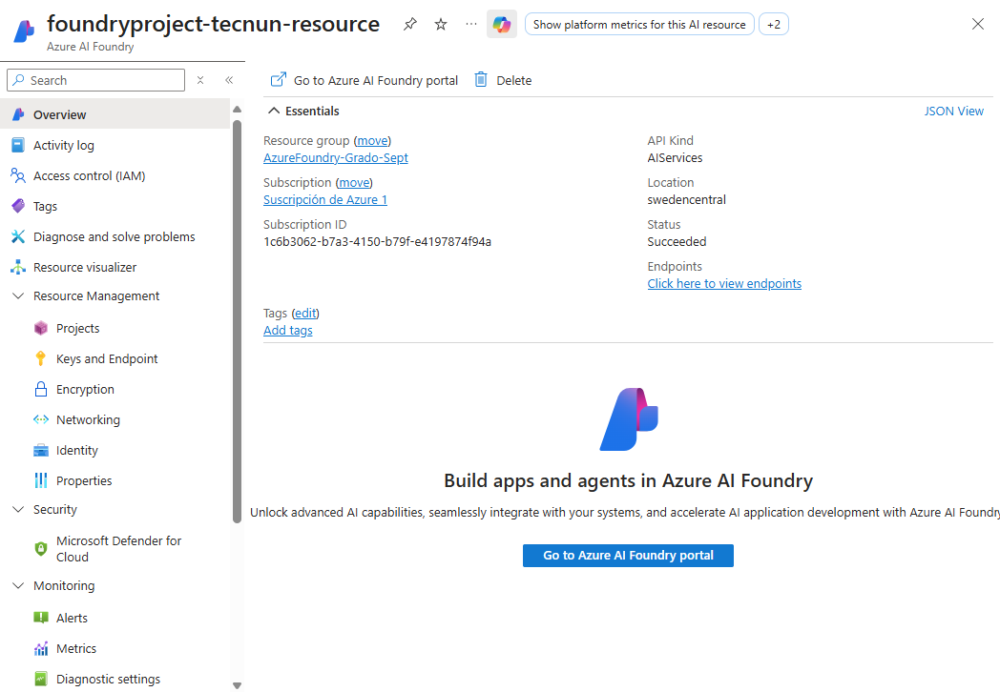

- **Overview**: This is the overview of the Azure Foundry resource. You can see the location, resource group, subscription, region and other details about the resource.
    

- **Access Control (IAM)**: This is where you can manage access to the Azure Foundry resource. You can add or remove users and assign roles to them.

    > NOTE: You have been given the **Azure AI User** role for this resource. You will be able to use the models deployed to this Foundry, but you will not be able to manage the resource.

- **Keys and Endpoint**: This is where you can find the keys and endpoint for the Azure Foundry resource. You will need these to connect to the Foundry from your application.

- **Networking**: This is where you can manage the networking settings for the Azure Foundry resource. You can configure virtual networks, private endpoints, and other networking settings.

- **Monitoring**: This is where you can monitor the Azure Foundry resource. You can view metrics, logs, and other monitoring data.

From the overview page, click on the link to the Foundry Portal (https://ai.azure.com). This will take you to the Azure Foundry portal.

The Foundry can be used for several scenarios, including:
- Model Management: You can deploy, manage, and monitor AI models in a centralized location.
- Playground: You can test and evaluate different AI models and configurations.
- Projects: You can create projects to organize and manage your AI models and resources.
- Fine Tuning: You can fine-tune pre-trained models to better suit your specific use cases.
- Evaluation: You can evaluate the performance of your AI models using various metrics and benchmarks.
- More....

In this lab, we will focus on the **Model Catalog** and **Playgrounds** sections of the Foundry.

### TASK 2 - Exploring the Model Catalog

In this task, you will explore the Model Catalog in the Azure Foundry portal. The Model Catalog is where you can find all the AI models that have been deployed to the Foundry.

Click on the **Model Catalog** option in the left column. You will see a list of all the models that have been deployed to the Foundry.

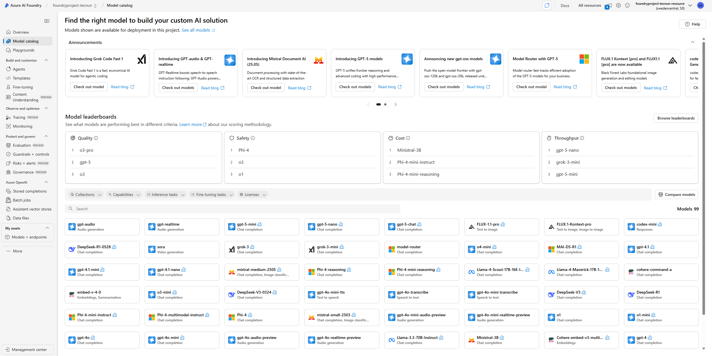

You will see Azure AI Foundry offers so many different types and providers of models:

- Providers like: Azure OpenAI, Microsoft, Hugging Face, Cohere, etc.
- Types like: Chat, Text Generation, Embeddings, Image Generation, etc.

Search for `gpt-4.1` in the search bar:

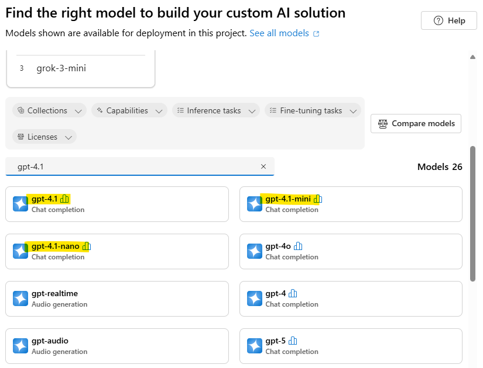

Focus on the 3 model options given for GPT-4.1:
- GPT-4.1 (Azure OpenAI)
- GPT-4.1-mini (Microsoft)
- GPT-4.1-nano (Microsoft)

This shows the different model variations that are available for GPT-4.1. Remember the main differences discussed in class between LLM and SLM models. The GPT-4.1 (Azure OpenAI) is a Large Language Model (LLM) while the GPT-4.1-mini and GPT-4.1-nano are Small Language Models (SLM).

Click on the `GPT-4.1 (Azure OpenAI)` model. You will see the details of the model, including the description, version, provider, and other details.

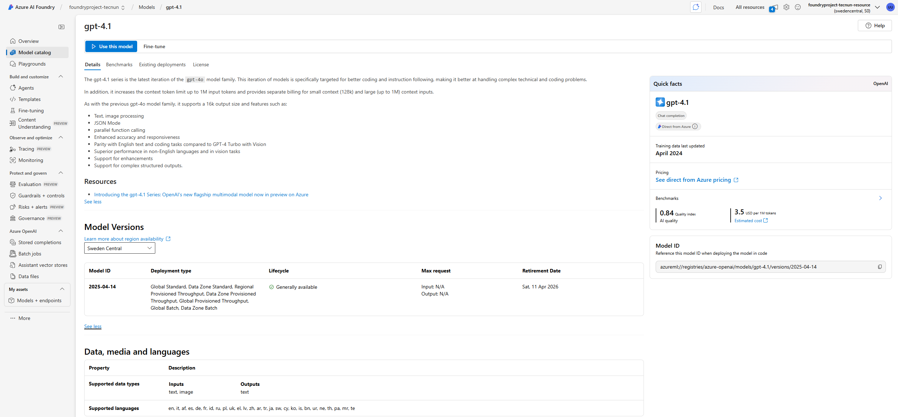

 - **Description**: This is a brief description of the model. It provides an overview of the model's capabilities and use cases.
 - **Version**: This is the version of the model. It indicates the specific iteration of
    the model that is deployed.
- **Input/Outputs**: This section provides information about the input and output formats of the model. It describes the expected input data and the format of the output generated by the model.
- **Pricing**: This section provides information about the pricing of the model. It describes the cost associated with using the model, including any usage-based fees or subscription plans.
- **Regions**: This section provides information about the regions where the model is available. It describes the geographic locations where the model can be accessed and used.

Take a look at the **Benchmarks** tab. This tab provides information about the performance of the model on various benchmarks. You can see the results of the model on different tasks and datasets.

Lets compare the three models mentioned before: GPT-4.1 (Azure OpenAI), GPT-4.1-mini (Microsoft), and GPT-4.1-nano (Microsoft).

Click on **compare with more models** , delete existing ones and select the other two models. You will see a comparison of the three models, including their performance on various benchmarks.

For example, you can see the Quality/Cost comparison chart:

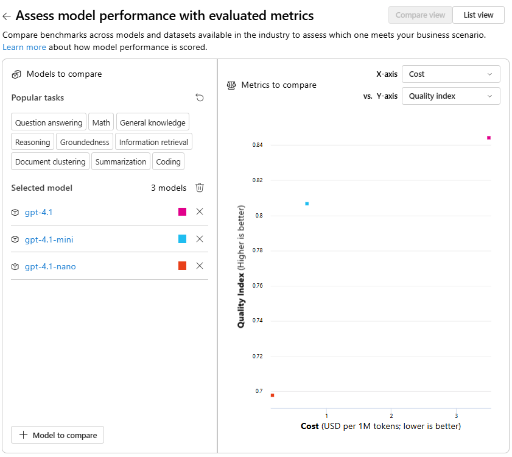

#### TASK 2 - EXERCISE 1

1. Take a screenshot of the comparison chart for the three GPT-4.1 models, comparing Quality/Latency and upload it to ADI as proof of completing this exercise. **The picture must show the USERNAME/EMAIL to be taken as VALID**. Upload as `TASK2-EXERCISE1-<YOUR NAME>.png`

Example:

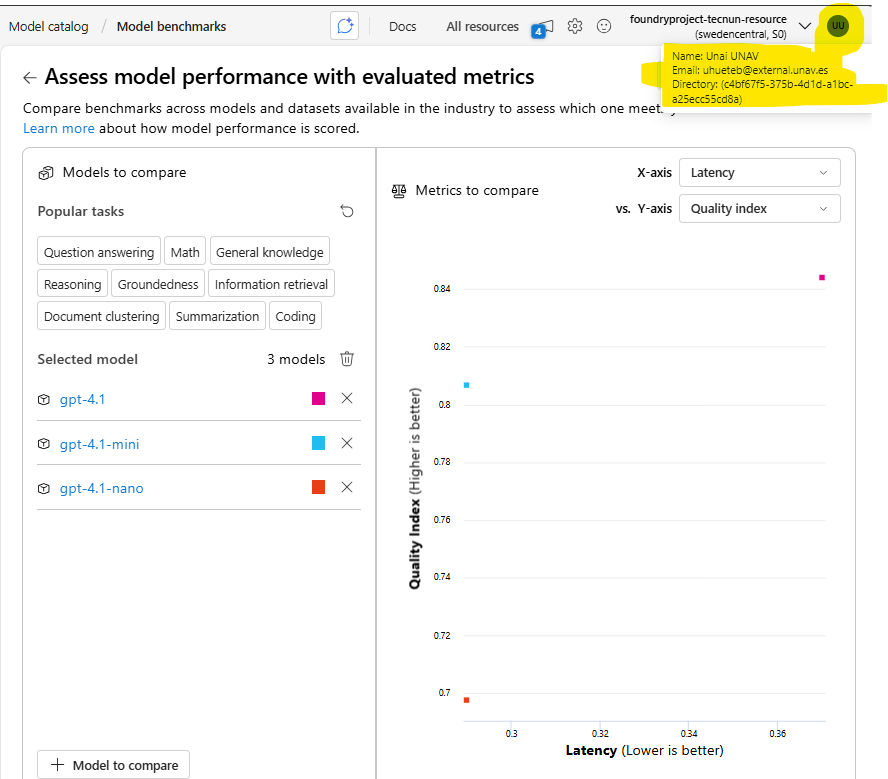

### TASK 3 - Model Deployment

Go back the overview page of the `gpt-4.1 (Azure OpenAI)` model and click on the **Use this model** button.

The website will show you the options available to **deploy** you own instance of this models. You can choose properties like:
- Deployment Name
- Deployment Type: different regional and pricing options
- Under "Customize"
    - Model Version
    - Token per Minute Rate Limit: to control costs 
- Content Filters: controlling the type of content that can be generated by the model, making sure it is safe and appropriate for your use case.

For this lab ** YOU WONT DEPLOY A NEW INSTANCE OF THE MODEL**, an instance of the model has already been deployed for you.

Go to the left column and click on **Models + endpoints**. This is where you can see all the models that have been deployed to the Foundry. You will find an instance of the `gpt-4.1-mini (Azure OpenAI)` model , that will be used in the next exercises. 

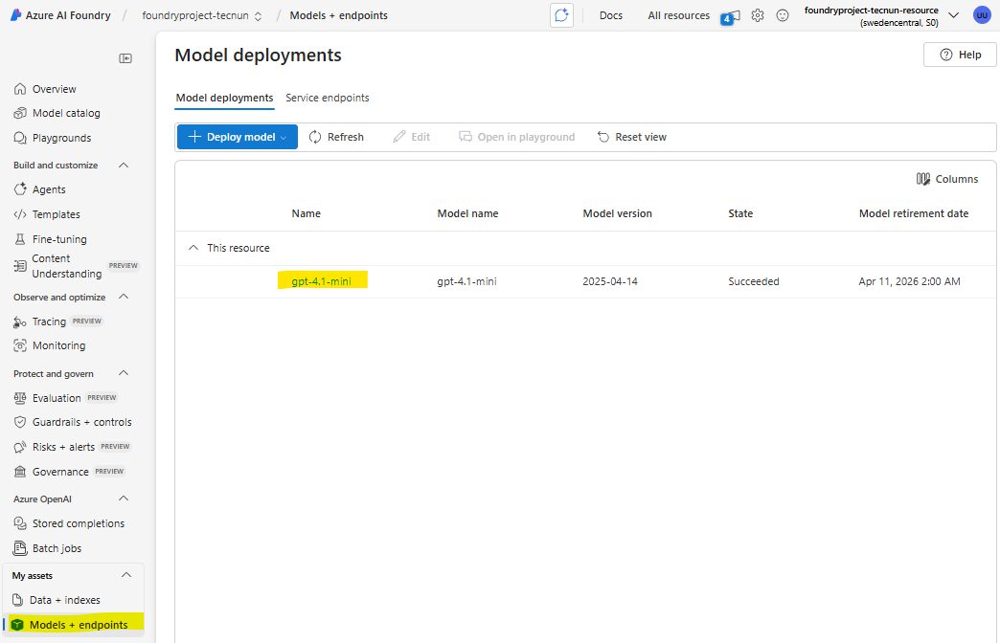

Click on it, you will see all the details of the deployed model, including many application templates you can use to programatically call this model.

Click on the **Open in Playground** button. This will open the Chat Playground for this model, an interface that can be used to make calls to the model.

### TASK 4 - Understanding GPT models using Playground

In this task, you will explore the Chat Playground for the `gpt-4.1-mini (Azure OpenAI)` model. The Chat Playground is an interface that can be used to make calls to the model.

You will learn about many different concepts related to GPT models in a practical way.

#### TASK 4 -  1 Training Data

The training data is a crucial aspect of any machine learning model, including GPT models. It refers to the dataset that is used to train the model, allowing it to learn patterns and relationships in the data.

When asking questions to a GPT model we need to take into account that the model by itself (no extra components) can only answer questions based on the data it has been trained on.

Try the following example, ask the model "Who is the president of the USA?" and click on the **Send** button.

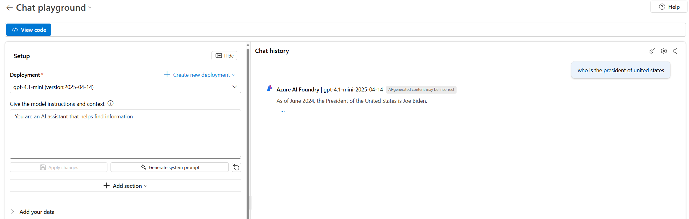

You can see the model answers gives "Joe Biden" as the answer. We can clearly see that the model can answer this question based on its training data.

#### TASK 4 - EXERCISE 1
Try you own example question that reflects how the training data of the model may not be up to date. Upload the results as `TASK4-EXERCISE1-<YOUR NAME>.png`. **The picture must show the USERNAME/EMAIL to be taken as VALID**.

#### TASK 4 - 2 Conversation History 

The conversation history is an important aspect of agentic/chatbot solutions created using GPT models. It allows the model to keep track of the context and flow of the conversation, enabling it to provide more relevant and coherent responses.

Lets try the following example. Ask the model the following questions in sequence, replace `<YOUR NAME>` with your actual name:
1. "Hello, my name is <YOUR NAME>."
2. "What is my name?"

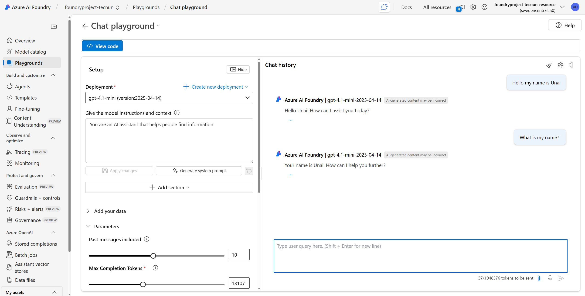

You will see the model is able to remember your name and provide it as the answer to the second question. Now the question should be **"DOES THE MODEL REALLY REMEMBER MY NAME?"**

The answer is **NO**. The model does not really remember your name, what it does is to use the conversation history to provide context to the model. 

In simple words, when calling the model, you are sending the conversation history as the request! You are able to choose how the conversation history is send/treated, it is one of the most interesting features to develop when creating agentic/chatbot solutions.

Now try the following example, but first, change the **Paremeters** section and **Past messages included** to the minimum (1):

1. "Hello, my name is <YOUR NAME>."
2. "Where is Tecnun based?"
3. "What is my name?"

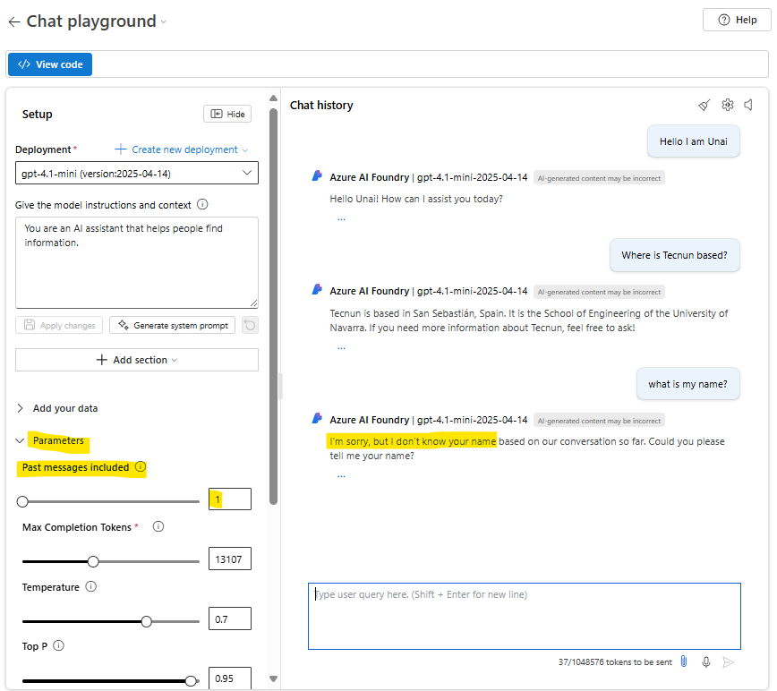

You will see the model is not able to remember your name and provide it as the answer to the third question. This is because the conversation history is not being sent to the model, so it does not have the context to provide a relevant answer.

#### TASK 4 - EXERCISE 2
Try you own example question that reflects how the conversation history is used by the model. Upload the results as `TASK4-EXERCISE2-<YOUR NAME>.png`. **The picture must show the USERNAME/EMAIL to be taken as VALID**.

#### TASK 4 - 3 System Message

The system message is an important component of the GPT architecture. It provides context and instructions to the model, helping it understand the user's intent and the specific requirements of the task at hand.

In the Chat Playground, you can see the system message at the left of the chat interface, under "Give the model instructions and context".

Try the following example with the default system message (do not change it):
"The food was disgusting and the service was terrible."

As the model does not have any context, it will provide a generic response.

Now change the system message (click on "Apply Changes") to:
"You are a food critic. You review restaurants and give them a rating of: Positive, Neutral, or Negative."

And try the same example again:
"The food was disgusting and the service was terrible."

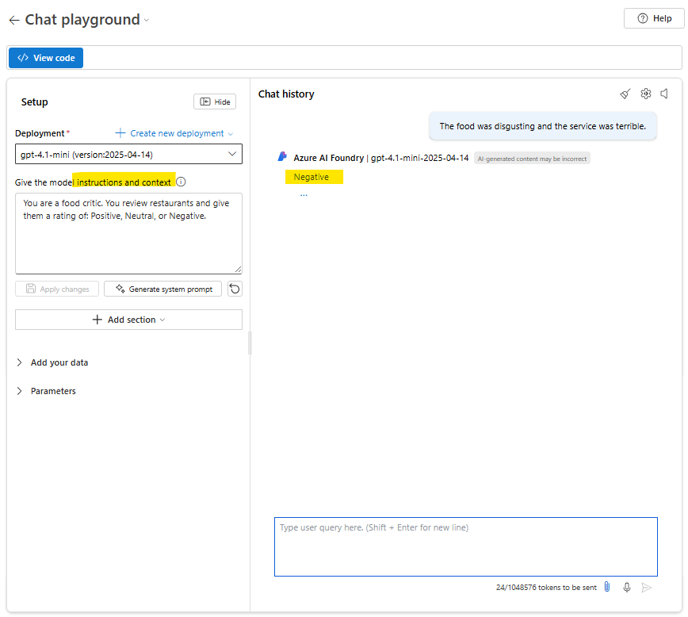

Now the model is able to provide a more relevant response, as it has the context of being a food critic.

When you send a request to the model, the system message is sent as part of the request, providing context to the model. The model usually receives 3 types of messages:
- System Message: Provides context and instructions to the model.
- User Message: The message sent by the user.
- Assistant Message: The message generated by the model.

Many User/Assistant messages can be sent as part of the conversation history. (Also for the next technique discussed, Few Shot Examples).

#### TASK 4 - EXERCISE 3
Try you own example question that reflects how the system message is used by the model. Upload the results as `TASK4-EXERCISE3-<YOUR NAME>.png`. **The picture must show the USERNAME/EMAIL to be taken as VALID**.

#### TASK 4 - 4 Few Shot Examples

Few shot examples are a powerful technique used in GPT models to provide the model with additional context and examples of the desired output. This helps the model understand the user's intent and generate more relevant and accurate responses.

In the Chat Playground, you can add  few shot examples at the left of the chat interface, under "Add Section > Examples".

Try the following example:
1. System Message: "You are a helpful assistant AI Assistant". (really generic to focus on the use of examples)

2. Request for the model: "what is the capital of France?"

You will see the model is free to give the response on the best way it thinks (free format text)

Now lets use the **Few Shot Learning** technique to guide the model to provide a more structured response.
1. System Message: "You are a helpful assistant AI Assistant". (really generic to focus on the use of examples)
2. Add the following example ("Add Section > Examples") to get the answer in JSON format ("Apply changes" after adding the example):
    - User: "What is the Capital of France?"
    - Assistant: "{ "Capital": "Paris" }"
  
3. Request for the model: "What is the capital of Sweden?"

You will see the model is able to provide the answer in the desired JSON format, as it has been given an example of the desired output. We "teach" the model how to answer by giving it an example.

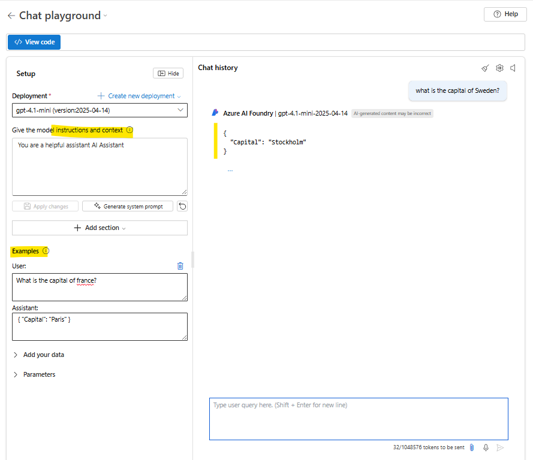

#### TASK 4 - EXERCISE 4
Try you own example question that reflects how the **few shot examples** are used by the model. Upload the results as `TASK4-EXERCISE4-<YOUR NAME>.png`. **The picture must show the USERNAME/EMAIL to be taken as VALID**.
   
#### TASK 4 - 5 Parameters

Parameters are settings that can be adjusted to control the behavior of the GPT model. They allow you to modify the model's responses and tailor them to your specific use case.

In the Chat Playground, you can see the parameters section at the left of the chat interface, under "Parameters". Some of the most important parameters are:
- **Temperature**: This parameter controls the randomness of the model's responses. A higher temperature value (e.g., 0.8) will result in more diverse and creative responses, while a lower temperature value (e.g., 0.2) will result in more focused and deterministic responses. 
- **Max Tokens**: This parameter controls the maximum length of the model's responses. It limits the number of tokens (words or subwords) that the model can generate in its response.
- And many more (less frequently used ones): Top P, Frequency Penalty, Presence Penalty, etc.

Try the following example for Max Completion Tokens:
1. System Message: "You are a helpful assistant AI Assistant". (really generic to focus on the use of examples)
2. Max Completion Tokens: 1000
3. Request for the model: "Explain me in detail what Tecnun is"

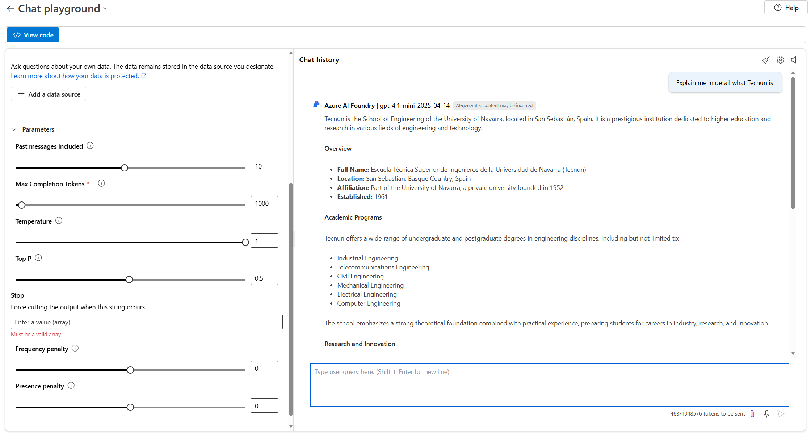

You will see the model is able to provide a detailed response, as it has enough tokens to generate a long answer.

Now change the Max Completion Tokens to 100 and try the same example again:

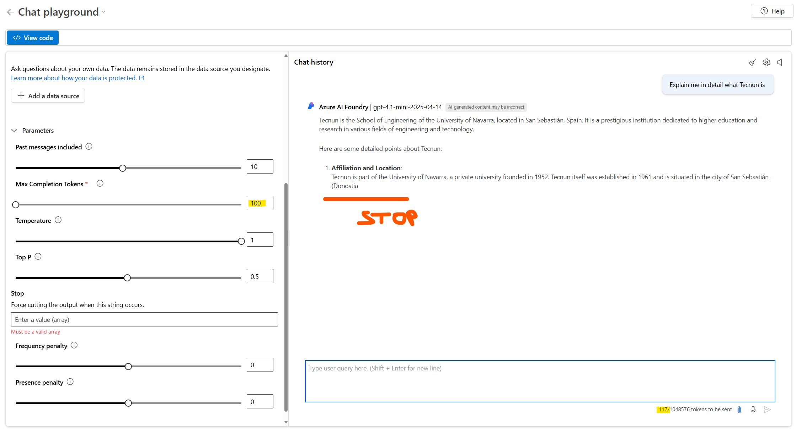

You will see the model is not able to provide a detailed response, as it does not have enough tokens to generate a long answer.

#### TASK 4 - EXERCISE 5
Try you own example question that reflects how the **parameters** are used by the model. Upload the results as `TASK4-EXERCISE5-<YOUR NAME>.png`. **The picture must show the USERNAME/EMAIL to be taken as VALID**.

### TASK 5 - RAG (Retrieval Augmented Generation) with Azure Foundry

What is RAG?

RAG (Retrieval Augmented Generation) is a technique that combines the power of large language models (LLMs) with **external knowledge sources** to improve the quality and relevance of generated content. By integrating retrieval mechanisms into the generation process, RAG enables LLMs to access and utilize specific information from external databases, documents, or other resources, resulting in more accurate and contextually appropriate outputs.

Basically when custom data is needed to answer a question, RAG is used to retrieve the relevant information from an external source and provide it to the LLM to generate a more accurate response.

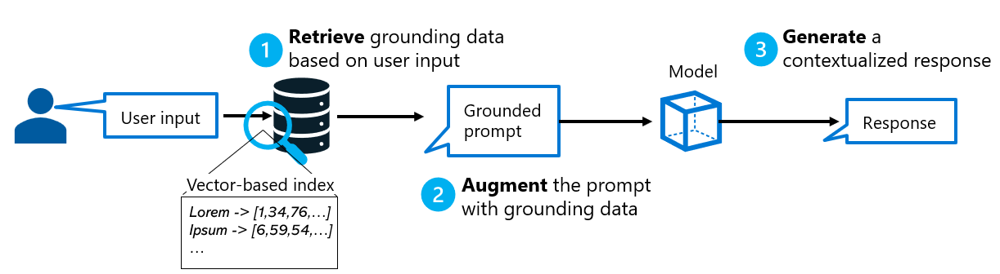

These are steps followed by a tipical RAG architecture:
1. **User Input/Question**: The user submits a query or question to the system.
2. **Retrieval**: The system uses a retrieval mechanism (like a search engine or a vector database) to find relevant documents or information from an external knowledge source based on the user's input.
    >NOTE: For our lab we will use an **Azure Search** resource as the external knowledge source.
3. **Augmentation**: The retrieved documents or information are then combined with the user's input. Basically we send 2 inputs to the Gen AI model
    3.1 The user input/question
    3.2 The relevant information retrieved from the external source, the **relevant search results**.

On this labs we are going to Analyze each component of the RAG architecture and test it in practice using Azure Foundry.

### Task 5 - 1 - Components Involved in RAG

The main components involved in a RAG architecture are:
1. **Large Language Model (LLM) or SLM (Small Language Model)**: This is the core component of the RAG architecture. It is responsible for generating text based on the input it receives. In our case, we will use the `gpt-4.1-mini (Azure OpenAI)` model deployed in the Azure Foundry. **Already explained in previous tasks**.

2. **Data Index / Vector Database**: This component is responsible for retrieving relevant documents or information from an external knowledge source based on the user's input. In our case, we will use an **Azure Search** resource as the Data Index / Vector Database keeping our custom data

3. **Embedding Model**: This component is responsible for converting text into vector representations (embeddings) that can be used for similarity search. In our case, we will use the `text-embedding-ada-002` model from Azure OpenAI to generate embeddings/vectors for our custom data.

### Task 5 - 2 - Azure Search Resource

In this task, you will explore the Azure Search resource that has been set up for you. The Azure Search resource is used as the Data Index / Vector Database in our RAG architecture.

Lets imagine we are a travel agency. This travel agency for many years has been creating travel guides for different cities around the world. The travel guides are in PDF format and contain information about the city, including places to visit, restaurants, hotels, etc.

You can use the sample travel brochure provided in the workspace: [London Brochure.pdf](./London%20Brochure.pdf)

Our PDF are considered **our RAW data**. In order to make this data searchable, we need to extract the text from the PDF and create an index in Azure Search. An index is a collection of documents that can be searched. Each document contains fields that can be searched and filtered.

Each document in the index will represent a section of the PDF. The fields in the document will represent the different attributes of the section, like:
- Title
- Content
- And many more fields that could be created for filtering/ordering purposes.

Go to the Azure Portal (https://portal.azure.com) and navigate to the resource group `AzureFoundry-Grado-Sept`, you will see a resource called `searchtecnun`. This is the Azure Search resource that has been set up for you.

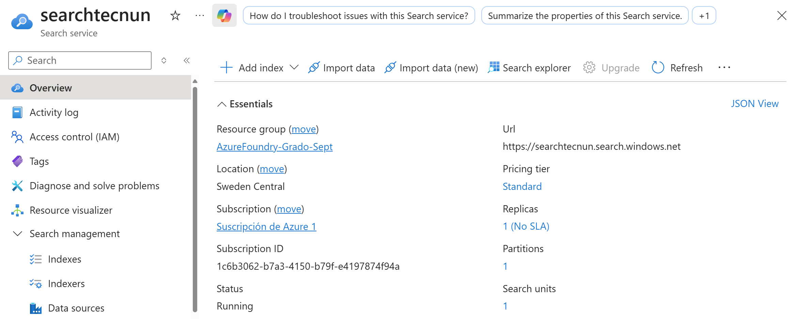

Traditionally, searching engines have relied on **keyword-based search**, which can be limited in its ability to understand the context and meaning of the text. If a client was looking for **"Barcelona"**, a keyword-based search engine would only return documents with fields contain the exact word "Barcelona". It would not return documents that contain synonyms or related terms, like "Catalonia" or "Sagrada Familia".

**Vector Search** is a more advanced technique that uses machine learning to understand the context and meaning of the text. It **converts the text into vector** representations (embeddings) that can be used for similarity search (cosine similarity, similarity between vectors). This allows the search engine to return documents that are **similar in meaning, even if they do not contain the exact keywords**.

For the exercise we have taken those RAW PDF travel agency brochures and created an index in the Azure Search resource. The 4 original brochures have been stored in a storage account , processed and indexed. The index is called `rag-1758550374815`. You can see the index by clicking on the **Indexes** option in the left column in the Azure Portal of the Azure Search resource.

Open the index, you will see the **fields** that have been created for the index. The most important fields are:
- **chunk**: This field contains the text content of the section. 
- **title**: This field contains the title of the section.
- **text_vector**: This field contains the vector representation (embedding) of the text content. **This field is used for vector search**.

Lets try keyword-based search directly from the Portal. Click on the **Search explorer** option in the left column. This is where you can test the search capabilities of the Azure Search resource. Look for "London".

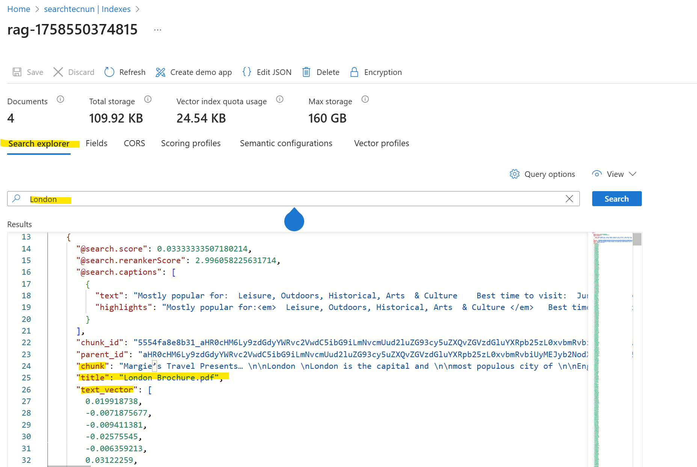

We can see the search return the London PDF brochure as the top result, as it contains the keyword "London". 

Lets understand why RAG is adding value here: is not only about finding information using vector search/comparison, is also about using a LLM to generate a more human-like response based on the information retrieved.

### Task 5 - 3 - Embedding Model

In this task, you will explore the embedding model that has been set up for you. The embedding model is used to convert text into vector representations (embeddings) that can be used for similarity search.

Azure search has been configured to use the `text-embedding-ada-002` model from Azure OpenAI to generate embeddings/vectors for our custom data. Our questions will also be converted to vectors using the same embedding model, so we can compare the vectors and find the most relevant documents.

### Task 5 - 4 Test without RAG

Go to the Azure Foundry portal (https://ai.azure.com) and open the Chat Playground for the `gpt-4.1-mini (Azure OpenAI)` model deployed in the Azure Foundry.

With the default configuration of the model (no RAG components added), try to ask a question related to the travel brochures, for example:
"Tell me about the best months to visit London"

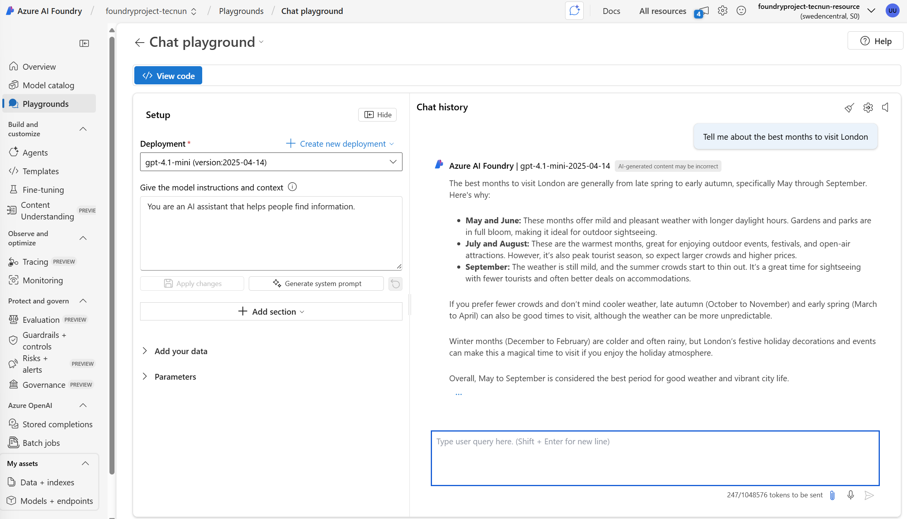

You will see the model only provide a generic answer based on its training data.

### Task 5 - 5 - Putting it all together - RAG

Lets try all components together. We will use the Chat Playground for the `gpt-4.1-mini (Azure OpenAI)` model deployed in the Azure Foundry to make calls to the model. Go  to the AI Foundry portal (https://ai.azure.com) and open the Chat Playground for the `gpt-4.1-mini (Azure OpenAI)` model.

Click on **Add your data source**. This is where you can configure the RAG components to use your custom data. The following information has to be selected to use the preconfigured Azure AI Search Index:

- Select Data Source: `Azure AI Search`
- Subscription: `Suscripción de Azure 1`
- Search Service: `searchtecnun`
- Index: `rag-1758550374815`
- SELECT > Add Vector Search...
- Embedding Model: `text-embedding-ada-002`

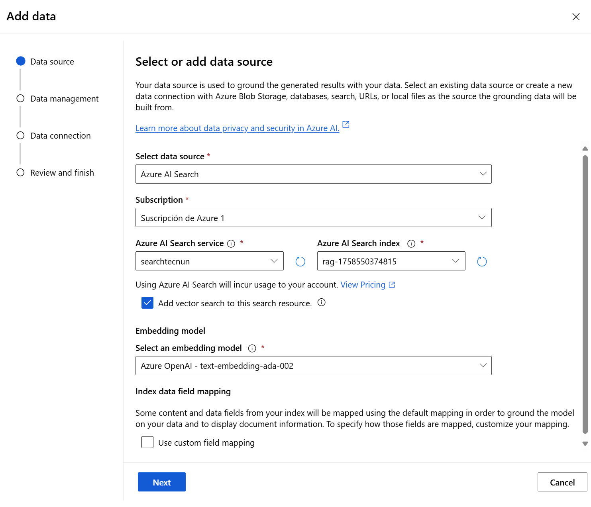

Click on **Next**. Now select the following options:
- Search Type: `Hybrid (Vector + keyword)`

Click on **Next**. Choose:
- Azure resource authentication type : `API Key`

Click on **Next**. Click on **Save and close**. 

Now is the moment to try RAG. Ask the model the same question as before:
"Tell me about the best months to visit London"

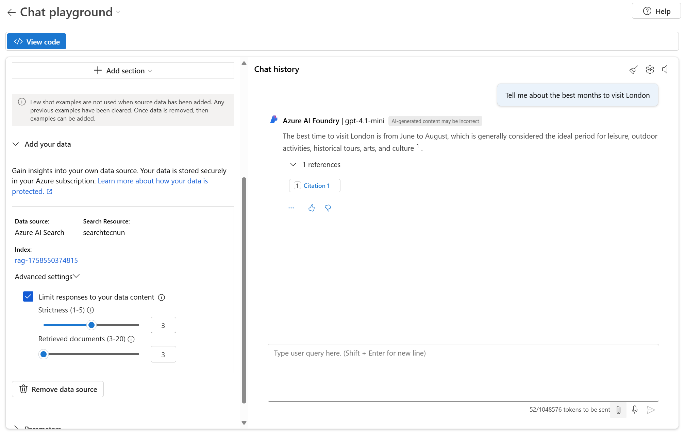

You can see the model is able to provide a  relevant answer **based on the custom data we have provided from AI Search**. 

The main difference between RAG and no RAG is the next: a search solution without RAG would have given you the full unmodified text field (the full PDF section) as the answer (green in picture). With RAG, the LLM is able to generate a more human-like response based on the information retrieved, **giving you a focused answer** (information in the red section, reworded by model). 

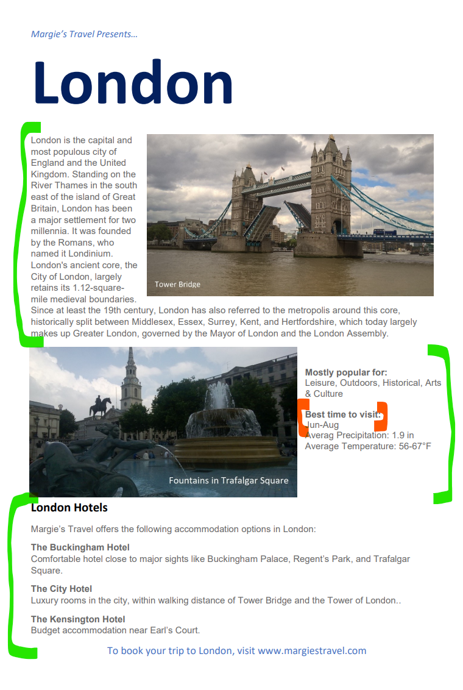

Apart from the answer, RAG solutions can also be customized to **only return answers contained in the custom data** (no generic answers based on training data).

Try the following on the Playground: 
- Make sure the option "Limit responses to your data content" is checked.
- Questions: "Can you tell me something about Tecnun?"

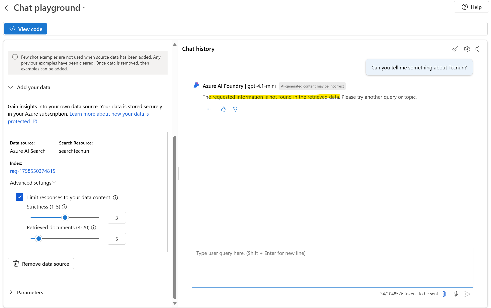

You can see the model is not able to provide a relevant answer, as there is no information about Tecnun in the custom data. The solution is configured to only provide answers based on the custom data, so it does not provide a generic answer based on its training data.

Unchecking the option "Limit responses to your data content" will allow the model to provide a generic answer based on its training data.

#### TASK 5 - EXERCISE 1
Try you own example question that reflects how RAG is used to provide relevant answers based on custom data. 

Take a look at the provided PDF brocures that have been indexed in Azure Search for ideas. You can see the PDFs going to the Azure Portal, navigating to the resource group `AzureFoundry-Grado-Sept`, opening the storage account `stgradosept`, opening `Containers` on the left column and `destination` container.  Right click for downloading the files from the `rag-pdfs` container.

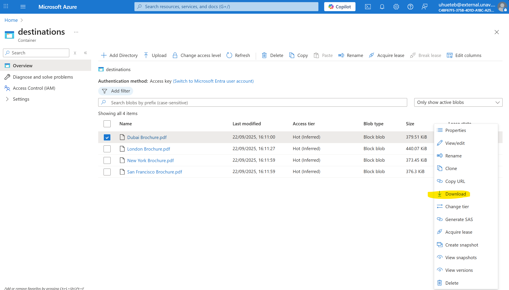

Show a Playground query that gives an answer citating the custom data. Similar to:

Upload the results as `TASK5-EXERCISE1-<YOUR NAME>.png`. **The picture must show the USERNAME/EMAIL to be taken as VALID**.

### Task 6 - Responsible AI(Optional)

### Task 7 - Python App (Optional)

