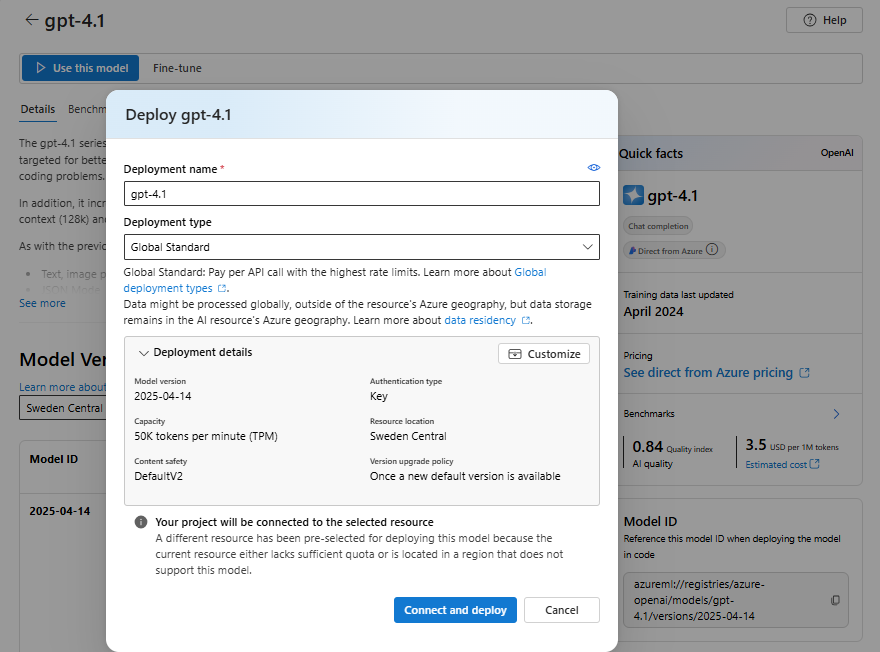

# Azure Foundry Labs

# Introduction to Azure Foundry

## Scenarios Covered
- Overview of Azure Foundry
- Models and Capabilities
- Calling Models from Azure Foundry and using different techniques
    - System Message
    - Parameters
    - Few Shot Examples
    - Conversation History

## EXERCISES TO BE UPLOADED
There will be sections in the document were the student will have to upload a file to ADI to show they have completed the exercise.

### TASK 1 - Setting up Azure Foundry

In this task you will see the Azure AI Foundry that has been set up for you. You will also see the models that have been deployed to this Foundry.

If you open the Azure Portal (https://portal.azure.com) and navigate to the resource group `AzureFoundry-Grado-Sept`, you will see a resource called `foundryproject-tecnun-resource`. This is the Azure Foundry resource that has been set up for you.

Open the resource and expand all the options on the left column. You will see the following options:

- **Overview**: This is the overview of the Azure Foundry resource. You can see the location, resource group, subscription, region and other details about the resource.
    

- **Access Control (IAM)**: This is where you can manage access to the Azure Foundry resource. You can add or remove users and assign roles to them.

    > NOTE: You have been given the **Azure AI User** role for this resource. You will be able to use the models deployed to this Foundry, but you will not be able to manage the resource.

- **Keys and Endpoint**: This is where you can find the keys and endpoint for the Azure Foundry resource. You will need these to connect to the Foundry from your application.

- **Networking**: This is where you can manage the networking settings for the Azure Foundry resource. You can configure virtual networks, private endpoints, and other networking settings.

- **Monitoring**: This is where you can monitor the Azure Foundry resource. You can view metrics, logs, and other monitoring data.

From the overview page, click on the link to the Foundry Portal (https://ai.azure.com). This will take you to the Azure Foundry portal.

The Foundry can be used for several scenarios, including:
- Model Management: You can deploy, manage, and monitor AI models in a centralized location.
- Playground: You can test and evaluate different AI models and configurations.
- Projects: You can create projects to organize and manage your AI models and resources.
- Fine Tuning: You can fine-tune pre-trained models to better suit your specific use cases.
- Evaluation: You can evaluate the performance of your AI models using various metrics and benchmarks.
- More....

In this lab, we will focus on the **Model Catalog** and **Playgrounds** sections of the Foundry.

### TASK 2 - Exploring the Model Catalog

In this task, you will explore the Model Catalog in the Azure Foundry portal. The Model Catalog is where you can find all the AI models that have been deployed to the Foundry.

Click on the **Model Catalog** option in the left column. You will see a list of all the models that have been deployed to the Foundry.

You will see Azure AI Foundry offers so many different types and providers of models:

- Providers like: Azure OpenAI, Microsoft, Hugging Face, Cohere, etc.
- Types like: Chat, Text Generation, Embeddings, Image Generation, etc.

Search for `gpt-4.1` in the search bar:

Focus on the 3 model options given for GPT-4.1:
- GPT-4.1 (Azure OpenAI)
- GPT-4.1-mini (Microsoft)
- GPT-4.1-nano (Microsoft)

This shows the different model variations that are available for GPT-4.1. Remember the main differences discussed in class between LLM and SLM models. The GPT-4.1 (Azure OpenAI) is a Large Language Model (LLM) while the GPT-4.1-mini and GPT-4.1-nano are Small Language Models (SLM).

Click on the `GPT-4.1 (Azure OpenAI)` model. You will see the details of the model, including the description, version, provider, and other details.

 - **Description**: This is a brief description of the model. It provides an overview of the model's capabilities and use cases.
 - **Version**: This is the version of the model. It indicates the specific iteration of
    the model that is deployed.
- **Input/Outputs**: This section provides information about the input and output formats of the model. It describes the expected input data and the format of the output generated by the model.
- **Pricing**: This section provides information about the pricing of the model. It describes the cost associated with using the model, including any usage-based fees or subscription plans.
- **Regions**: This section provides information about the regions where the model is available. It describes the geographic locations where the model can be accessed and used.

Take a look at the **Benchmarks** tab. This tab provides information about the performance of the model on various benchmarks. You can see the results of the model on different tasks and datasets.

Lets compare the three models mentioned before: GPT-4.1 (Azure OpenAI), GPT-4.1-mini (Microsoft), and GPT-4.1-nano (Microsoft).

Click on **compare with more models** , delete existing ones and select the other two models. You will see a comparison of the three models, including their performance on various benchmarks.

For example, you can see the Quality/Cost comparison chart:

#### TASK 2 - EXERCISE 1

1. Take a screenshot of the comparison chart for the three GPT-4.1 models, comparing Quality/Latency and upload it to ADI as proof of completing this exercise. **The picture must show the USERNAME/EMAIL to be taken as VALID**. Upload as `TASK2-EXERCISE1-<YOUR NAME>.png`

Example:

### TASK 3 - Model Deployment

Go back the overview page of the `gpt-4.1 (Azure OpenAI)` model and click on the **Use this model** button.

The website will show you the options available to **deploy** you own instance of this models. You can choose properties like:
- Deployment Name
- Deployment Type: different regional and pricing options
- Under "Customize"
    - Model Version
    - Token per Minute Rate Limit: to control costs 
- Content Filters: controlling the type of content that can be generated by the model, making sure it is safe and appropriate for your use case.

For this lab ** YOU WONT DEPLOY A NEW INSTANCE OF THE MODEL**, an instance of the model has already been deployed for you.

Go to the left column and click on **Models + endpoints**. This is where you can see all the models that have been deployed to the Foundry. You will find an instance of the `gpt-4.1-mini (Azure OpenAI)` model , that will be used in the next exercises. 

Click on it, you will see all the details of the deployed model, including many application templates you can use to programatically call this model.

Click on the **Open in Playground** button. This will open the Chat Playground for this model, an interface that can be used to make calls to the model.

### TASK 4 - Understanding GPT models using Playground

In this task, you will explore the Chat Playground for the `gpt-4.1-mini (Azure OpenAI)` model. The Chat Playground is an interface that can be used to make calls to the model.

You will learn about many different concepts related to GPT models in a practical way.

#### TASK 4 -  1 Training Data

The training data is a crucial aspect of any machine learning model, including GPT models. It refers to the dataset that is used to train the model, allowing it to learn patterns and relationships in the data.

When asking questions to a GPT model we need to take into account that the model by itself (no extra components) can only answer questions based on the data it has been trained on.

Try the following example, ask the model "Who is the president of the USA?" and click on the **Send** button.

You can see the model answers gives "Joe Biden" as the answer. We can clearly see that the model can answer this question based on its training data.

#### TASK 4 - EXERCISE 1
Try you own example question that reflects how the training data of the model may not be up to date. Upload the results as `TASK4-EXERCISE1-<YOUR NAME>.png`. **The picture must show the USERNAME/EMAIL to be taken as VALID**.

#### TASK 4 - 2 Conversation History 

The conversation history is an important aspect of agentic/chatbot solutions created using GPT models. It allows the model to keep track of the context and flow of the conversation, enabling it to provide more relevant and coherent responses.

Lets try the following example. Ask the model the following questions in sequence, replace `<YOUR NAME>` with your actual name:
1. "Hello, my name is <YOUR NAME>."
2. "What is my name?"

You will see the model is able to remember your name and provide it as the answer to the second question. Now the question should be **"DOES THE MODEL REALLY REMEMBER MY NAME?"**

The answer is **NO**. The model does not really remember your name, what it does is to use the conversation history to provide context to the model. 

In simple words, when calling the model, you are sending the conversation history as the request! You are able to choose how the conversation history is send/treated, it is one of the most interesting features to develop when creating agentic/chatbot solutions.

Now try the following example, but first, change the **Paremeters** section and **Past messages included** to the minimum (1):

1. "Hello, my name is <YOUR NAME>."
2. "Where is Tecnun based?"
3. "What is my name?"

You will see the model is not able to remember your name and provide it as the answer to the third question. This is because the conversation history is not being sent to the model, so it does not have the context to provide a relevant answer.

#### TASK 4 - EXERCISE 2
Try you own example question that reflects how the conversation history is used by the model. Upload the results as `TASK4-EXERCISE2-<YOUR NAME>.png`. **The picture must show the USERNAME/EMAIL to be taken as VALID**.

#### TASK 4 - 3 System Message

The system message is an important component of the GPT architecture. It provides context and instructions to the model, helping it understand the user's intent and the specific requirements of the task at hand.

In the Chat Playground, you can see the system message at the left of the chat interface, under "Give the model instructions and context".

Try the following example with the default system message (do not change it):
"The food was disgusting and the service was terrible."

As the model does not have any context, it will provide a generic response.

Now change the system message (click on "Apply Changes") to:
"You are a food critic. You review restaurants and give them a rating of: Positive, Neutral, or Negative."

And try the same example again:
"The food was disgusting and the service was terrible."

Now the model is able to provide a more relevant response, as it has the context of being a food critic.

When you send a request to the model, the system message is sent as part of the request, providing context to the model. The model usually receives 3 types of messages:
- System Message: Provides context and instructions to the model.
- User Message: The message sent by the user.
- Assistant Message: The message generated by the model.

Many User/Assistant messages can be sent as part of the conversation history. (Also for the next technique discussed, Few Shot Examples).

#### TASK 4 - EXERCISE 3
Try you own example question that reflects how the system message is used by the model. Upload the results as `TASK4-EXERCISE3-<YOUR NAME>.png`. **The picture must show the USERNAME/EMAIL to be taken as VALID**.

#### TASK 4 - 4 Few Shot Examples

Few shot examples are a powerful technique used in GPT models to provide the model with additional context and examples of the desired output. This helps the model understand the user's intent and generate more relevant and accurate responses.

In the Chat Playground, you can add  few shot examples at the left of the chat interface, under "Add Section > Examples".

Try the following example:
1. System Message: "You are a helpful assistant AI Assistant". (really generic to focus on the use of examples)

2. Request for the model: "what is the capital of France?"

You will see the model is free to give the response on the best way it thinks (free format text)

Now lets use the **Few Shot Learning** technique to guide the model to provide a more structured response.
1. System Message: "You are a helpful assistant AI Assistant". (really generic to focus on the use of examples)
2. Add the following example ("Add Section > Examples") to get the answer in JSON format ("Apply changes" after adding the example):
    - User: "What is the Capital of France?"
    - Assistant: "{ "Capital": "Paris" }"
  
3. Request for the model: "What is the capital of Sweden?"

You will see the model is able to provide the answer in the desired JSON format, as it has been given an example of the desired output. We "teach" the model how to answer by giving it an example.

#### TASK 4 - EXERCISE 4
Try you own example question that reflects how the **few shot examples** are used by the model. Upload the results as `TASK4-EXERCISE4-<YOUR NAME>.png`. **The picture must show the USERNAME/EMAIL to be taken as VALID**.
   
#### TASK 4 - 5 Parameters

Parameters are settings that can be adjusted to control the behavior of the GPT model. They allow you to modify the model's responses and tailor them to your specific use case.

In the Chat Playground, you can see the parameters section at the left of the chat interface, under "Parameters". Some of the most important parameters are:
- **Temperature**: This parameter controls the randomness of the model's responses. A higher temperature value (e.g., 0.8) will result in more diverse and creative responses, while a lower temperature value (e.g., 0.2) will result in more focused and deterministic responses. 
- **Max Tokens**: This parameter controls the maximum length of the model's responses. It limits the number of tokens (words or subwords) that the model can generate in its response.
- And many more (less frequently used ones): Top P, Frequency Penalty, Presence Penalty, etc.

Try the following example for Max Completion Tokens:
1. System Message: "You are a helpful assistant AI Assistant". (really generic to focus on the use of examples)
2. Max Completion Tokens: 1000
3. Request for the model: "Explain me in detail what Tecnun is"

You will see the model is able to provide a detailed response, as it has enough tokens to generate a long answer.

Now change the Max Completion Tokens to 100 and try the same example again:

You will see the model is not able to provide a detailed response, as it does not have enough tokens to generate a long answer.

#### TASK 4 - EXERCISE 5
Try you own example question that reflects how the **parameters** are used by the model. Upload the results as `TASK4-EXERCISE5-<YOUR NAME>.png`. **The picture must show the USERNAME/EMAIL to be taken as VALID**.

